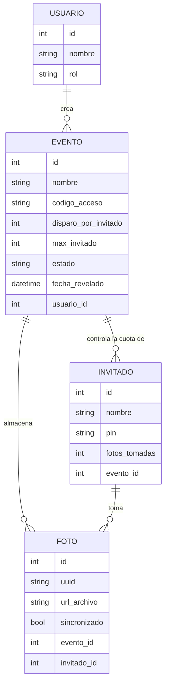
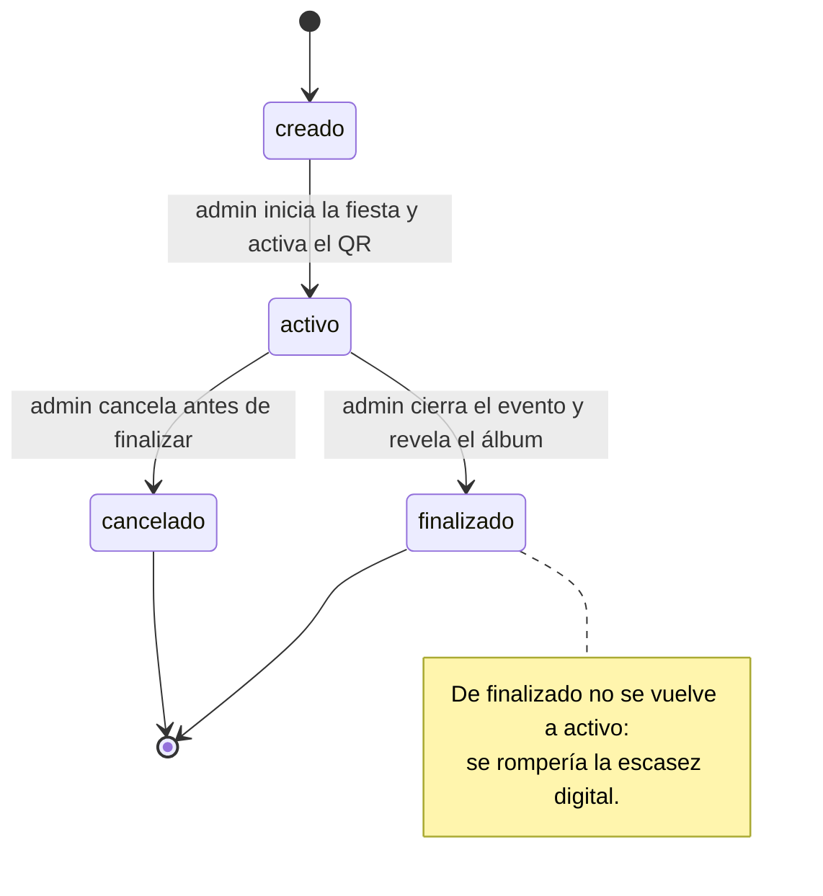

# Hito 1 · Ficha del negocio

**Pareja:** [Nombre] Garcia · Jean Carlos Vinces Chonillo
**Paralelo:** Aplicaciones Web II A
**Negocio en una línea:** Latent vende a los anfitriones de eventos sociales (bodas, cumpleaños, fiestas) una cámara digital desechable: sus invitados toman un número limitado de fotos y el anfitrión recibe el álbum completo.

## 1. Negocio de referencia

ONCE es una cámara desechable digital para eventos sociales (bodas, cumpleaños y fiestas), creada por Brian Shin y su novia. Vende a los anfitriones un pase para crear un carrete virtual: cada invitado entra sin descargar ninguna app y dispone de un número limitado de fotos, como en una cámara desechable de rollo, y las fotos no aparecen al instante, sino cuando se revelan. Cobra una tarifa plana por evento que crece con el número de asistentes, desde $2 USD para 10 personas hasta $50 USD para 150. Según Starter Story, el fundador declara que la app llegó a más de $20,000 USD mensuales a los 83 días de su lanzamiento. Latent toma de ONCE la idea central de que el límite de fotos es el producto: la escasez digital hace que el álbum sea pequeño, barato de almacenar y más valioso para el anfitrión.

**Enlace:** https://www.starterstory.com/brian

## 2. Caso de contraste

The Guest (antes Veri) fue una app para que los invitados de una boda subieran sus fotos y videos a un álbum compartido. The Knot compró Veri en 2017 y en octubre de 2018 la rebautizó como The Guest y la ofreció gratis a todas las parejas, cuando antes costaba $100; según The Knot, cada boda recibía en promedio 870 fotos y videos. A partir del 12 de octubre de 2022 dejó de permitir crear eventos nuevos y fue retirada. Nuestra hipótesis es de costos y de cobro: sin límite de fotos por invitado, cada evento genera cientos de archivos que hay que guardar en la nube, y al ser gratis la app no cobraba nada por ese almacenamiento. Un negocio sin ingreso por evento y con costo creciente por evento no se sostiene. Latent invierte ambas cosas: limita las fotos por invitado, lo que acota el costo de cada evento, y cobra una tarifa plana por evento.

**Fuente:** https://www.theknotww.com/press-releases/the-guest-photo-sharing-app (precio y cambio de nombre) · https://lense.app/the-guest-photo-sharing-alternative (cierre de octubre de 2022)

## 3. Adaptación al Ecuador

1. **Señal débil.** En salones de fiestas cerrados o en las afueras, el Wi-Fi y los datos móviles fallan o son lentos. Efecto: la foto se guarda primero en el celular (con un `uuid` y `sincronizado = no`) y se sube sola al recuperar la señal.
2. **Invitados sin apps ni cuentas.** En una fiesta nadie instala una app ni crea una cuenta. Efecto: Latent es una PWA a la que se entra con un código QR, y el invitado es un usuario temporal que solo da su nombre y un PIN de 4 dígitos.
3. **Límite fácil de evadir.** Si el límite de 3 fotos se guarda en las cookies del celular, el invitado lo borra y lo evade. Efecto: la cuota vive en el servidor, y cuando el invitado ya tomó 3 fotos, `POST /fotos` responde 403.

**Qué cambió en el modelo por estas restricciones:** por la restricción 3 se agregó la entidad `Invitado` (nombre único por evento, PIN de 4 dígitos y contador de fotos tomadas), para que el límite de 3 fotos viva en el servidor y no en el celular.

## 4. Modelo de datos

### Entidad: Usuario

| Atributo | Tipo | Obligatorio | Ejemplo |
|----------|------|-------------|---------|
| id | número entero | sí | 1 |
| nombre | texto | sí | Ana Garcia |
| rol | uno de: admin | sí | admin |

### Entidad: Evento

| Atributo | Tipo | Obligatorio | Ejemplo |
|----------|------|-------------|---------|
| id | número entero | sí | 5 |
| nombre | texto | sí | Boda de prueba |
| codigo_acceso | texto (único) | sí | BODA-7K2P |
| disparo_por_invitado | número entero | sí | 3 |
| max_invitado | número entero | sí | 50 |
| estado | uno de: creado, activo, finalizado, cancelado | sí | creado |
| fecha_revelado | fecha y hora | no (solo al finalizar) | 2026-10-10 23:30 |
| usuario_id | referencia a Usuario (admin) | sí | 1 |

### Entidad: Invitado

| Atributo | Tipo | Obligatorio | Ejemplo |
|----------|------|-------------|---------|
| id | número entero | sí | 12 |
| nombre | texto (único por evento) | sí | Carlos |
| pin | texto de 4 dígitos | sí | 0427 |
| fotos_tomadas | número entero | sí | 2 |
| evento_id | referencia a Evento | sí | 5 |

### Entidad: Foto

| Atributo | Tipo | Obligatorio | Ejemplo |
|----------|------|-------------|---------|
| id | número entero | sí | 31 |
| uuid | texto (único, creado en el celular) | sí | 7c9e6679-7425-40de-944b-e07fc1f90ae7 |
| url_archivo | texto | sí | /archivos/5/7c9e6679.jpg |
| sincronizado | sí/no | sí | sí |
| evento_id | referencia a Evento | sí | 5 |
| invitado_id | referencia a Invitado | sí | 12 |

### Relaciones

| Entidades | Cardinalidad | Frase |
|-----------|--------------|-------|
| Usuario – Evento | 1 a N | Un usuario admin crea muchos eventos |
| Evento – Invitado | 1 a N | Un evento controla la cuota de muchos invitados |
| Evento – Foto | 1 a N | Un evento almacena muchas fotos |
| Invitado – Foto | 1 a N | Un invitado toma muchas fotos (hasta el límite del evento) |

### Structs en Go

```go
type Usuario struct {
    ID     uint   `gorm:"primaryKey" json:"id"`
    Nombre string `gorm:"not null" json:"nombre"`
    Rol    string `gorm:"not null;default:admin" json:"rol"`
}

type Evento struct {
    ID                 uint       `gorm:"primaryKey" json:"id"`
    Nombre             string     `gorm:"not null" json:"nombre"`
    CodigoAcceso       string     `gorm:"uniqueIndex;not null" json:"codigo_acceso"`
    DisparoPorInvitado int        `gorm:"not null;default:3" json:"disparo_por_invitado"`
    MaxInvitado        int        `gorm:"not null" json:"max_invitado"`
    Estado             string     `gorm:"not null;default:creado" json:"estado"`
    FechaRevelado      *time.Time `json:"fecha_revelado"`
    UsuarioID          uint       `json:"usuario_id"`
    Invitados          []Invitado `json:"invitados"`
}

type Invitado struct {
    ID           uint   `gorm:"primaryKey" json:"id"`
    Nombre       string `gorm:"not null;uniqueIndex:idx_evento_nombre" json:"nombre"`
    Pin          string `gorm:"not null;size:4" json:"-"`
    FotosTomadas int    `gorm:"not null;default:0" json:"fotos_tomadas"`
    EventoID     uint   `gorm:"not null;uniqueIndex:idx_evento_nombre" json:"evento_id"`
}

type Foto struct {
    ID           uint   `gorm:"primaryKey" json:"id"`
    UUID         string `gorm:"uniqueIndex;not null" json:"uuid"`
    URLArchivo   string `gorm:"not null" json:"url_archivo"`
    Sincronizado bool   `gorm:"not null;default:false" json:"sincronizado"`
    EventoID     uint   `gorm:"not null" json:"evento_id"`
    InvitadoID   uint   `gorm:"not null" json:"invitado_id"`
}
```

**Decisión de tipos que tuvimos que pensar:** `FechaRevelado` es `*time.Time` (un puntero) y no `time.Time`, porque un evento recién creado todavía no tiene fecha de revelado. Con `time.Time` la respuesta de `POST /eventos` mostraba `0001-01-01T00:00:00Z`; con el puntero sale `null` hasta que el admin finaliza el evento. El `Pin` es `string` y no un entero, porque un PIN como `0427` perdería el cero inicial.

### Diagrama del modelo completo



**Decisión discutible del modelo y por qué la tomamos:** la cuota de fotos está en `Invitado` (nombre + PIN) y no en el identificador del celular. Con el celular, quien borra las cookies o cambia de navegador recupera sus fotos; con nombre y PIN, el contador sigue siendo el mismo y el límite vive en el servidor. El costo es que el invitado debe recordar un PIN de 4 dígitos.

## 5. Máquina de estados

**Entidad con estados:** Evento

| Estado | Qué significa |
|--------|---------------|
| creado (inicial) | El anfitrión registró el evento, pero todavía no inicia la fiesta |
| activo | La fiesta está en curso y los invitados pueden tomar fotos |
| finalizado | El anfitrión cerró el evento y reveló el álbum |
| cancelado | El anfitrión canceló el evento antes de finalizarlo |

| De | A | Quién la hace | Condición |
|----|---|---------------|-----------|
| creado | activo | admin | El anfitrión inicia la fiesta y activa el QR |
| activo | finalizado | admin | El anfitrión cierra el evento y revela el álbum |
| activo | cancelado | admin | El anfitrión cancela el evento antes de finalizarlo |

Las tres transiciones las hace el admin con un solo endpoint, `PATCH /eventos/{id}/estado`, enviando el nuevo estado (`activo`, `finalizado` o `cancelado`).

**Transición prohibida y por qué:** de finalizado no se vuelve a activo. Una vez que la fiesta terminó y el álbum se reveló, el backend en Go bloquea el estado de forma definitiva. Esto garantiza la escasez digital que promete Latent: no se alteran las cuotas ni se suben fotos fuera de tiempo.

### Diagrama de estados



## 6. Roles y permisos

| Acción | admin | invitado |
|--------|-------|----------|
| Crear un evento | sí | no |
| Unirse a un evento con el código de acceso | no | sí |
| Subir una foto | no | solo los suyos (hasta 3, con el evento activo) |
| Ver la galería del álbum | todos | todos |
| Cambiar el estado de un evento (iniciar, finalizar o cancelar la fiesta) | solo los suyos | no |

## 7. Mapa de endpoints por rol

| Endpoint | Rol que lo llama | Pantalla que lo consume | Qué devuelve | Qué valida | Código si falla |
|----------|------------------|-------------------------|--------------|------------|-----------------|
| POST /eventos | admin | Web: panel para crear nueva fiesta | El evento creado (201) con estado `creado` | Que lleguen nombre, disparo_por_invitado y max_invitado válidos | 400 |
| POST /eventos/unirse | invitado | Celular: ingreso de código de acceso | El invitado registrado en el evento (200) | Que el código de acceso exista | 404 |
| POST /fotos | invitado | Celular: interfaz de cámara (límite 3) | La foto guardada (201) | Que el evento esté activo y que el invitado no haya llegado al límite de fotos | 403 |
| GET /eventos/{id}/fotos | todos | Todos: galería en vivo del álbum | La lista de fotos del evento (200) | Que quien consulta esté identificado | 401 |
| PATCH /eventos/{id}/estado | admin | Web: panel de la fiesta (botones iniciar, cerrar y cancelar) | El evento con su nuevo estado (200); al finalizar, con `fecha_revelado` | Que el evento sea del admin, que el estado sea válido y que la transición esté permitida | 400 (estado desconocido) · 409 (transición no permitida) |

### Matriz pantalla × endpoint

| Pantalla | POST /eventos | POST /eventos/unirse | POST /fotos | GET /eventos/{id}/fotos | PATCH /eventos/{id}/estado |
|----------|---------------|----------------------|-------------|-------------------------|-----------------------------|
| Web: panel para crear nueva fiesta | X | | | | |
| Web: panel de la fiesta (iniciar, cerrar, cancelar) | | | | | X |
| Celular: ingreso de código de acceso | | X | | | |
| Celular: interfaz de cámara | | | X | | |
| Todos: galería en vivo del álbum | | | | X | |

**Endpoints que ya están funcionando y en qué archivo:** `POST /eventos` (probado en `http://localhost:8081/eventos`, responde 201). Los manejadores están en `servidor-pareja/internal/latent/manejadores.go` y las rutas en `servidor-pareja/internal/latent/rutas.go`. [Indica cuáles de los 5 endpoints ya responden.]

## 8. Declaración de IA

Usamos Claude (Anthropic) para revisar el borrador de las diapositivas contra la lista de cumplimiento (secciones 1 a 7), para buscar y verificar los enlaces de los casos de las secciones 1 y 2, y para redactar y ordenar esta ficha y el addendum a partir de nuestro modelo, nuestras diapositivas y nuestra captura de la API. [Si usaron otra herramienta, agréguenla aquí con la sección.]
